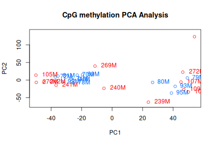

------------------------------------------------------------------------

# Overview — Goal 1

Genome-wide, treatment-independent characterization of the *M. trossulus* CpG
methylome plus the sample-level QC baseline, using the **24-sample** object
(`myobj_24`, incl. 93M) from `26-methylkit-object.Rmd`. Implements plan
sections 1.1, 1.2 and 1.5 (feature distribution is `28`, CpG O/E is `29`).

Output dir: `../output/27-methylation-landscape/`


``` bash
mkdir -p ../output/27-methylation-landscape
```


``` r
myobj_24 <- readRDS("../output/26-methylkit-object/myobj_24.rds")
meta     <- read.csv("../output/26-methylkit-object/sample_metadata.csv")
```

# 1.1 Per-sample global CpG methylation summary

Global **weighted** % CpG methylation = Σ methylated counts / Σ total counts.


``` r
per_sample <- do.call(rbind, lapply(seq_along(myobj_24), function(i) {
  d  <- getData(myobj_24[[i]])
  tot <- d$coverage
  meth <- d$numCs
  data.frame(
    sample          = myobj_24[[i]]@sample.id,
    n_CpG_covered   = nrow(d),
    mean_coverage   = mean(tot),
    median_coverage = median(tot),
    global_pct_meth = 100 * sum(meth) / sum(tot)
  )
})) |>
  left_join(meta, by = "sample")

write.csv(per_sample, "../output/27-methylation-landscape/per_sample_global_methylation.csv",
          row.names = FALSE)
per_sample
```

```
##    sample n_CpG_covered mean_coverage median_coverage global_pct_meth site pah
## 1    105M      18406826      8.811487               7        10.69423   HC   0
## 2    106M      18236271      8.108786               7        11.96869   HC   0
## 3    107M      18411128      8.774477               7        12.14405   HC   0
## 4    109M      18449061      8.892177               8        11.71570   HC   0
## 5    239M      18664539      9.705296               8        12.22455   AP   0
## 6    240M      18461218      8.988001               7        12.64607   AP   0
## 7    241M      18260327      8.584591               7        11.11752   AP   0
## 8    242M      18125656      9.624313               7        12.30548   AP   0
## 9    269M      18479390      9.097642               8        11.28963   BS   0
## 10   270M      18567451      9.372437               8        10.85165   BS   0
## 11   271M      18409816      8.598718               7        11.58444   BS   0
## 12   272M      18384196      8.506025               7        11.63563   BS   0
## 13    69M      18556653      9.458359               7        12.12169   EB   1
## 14    70M      18639486      9.604388               7        12.15043   EB   1
## 15    71M      18499400      9.331989               7        11.26490   EB   1
## 16    72M      18516075      9.058939               7        11.15854   EB   1
## 17    78M      18600722      9.490222               8        11.17434   SA   1
## 18    79M      18334331      8.634100               7        11.55505   SA   1
## 19    80M      18462899      9.016696               8        11.85947   SA   1
## 20    81M      18438174      8.873532               7        10.66505   SA   1
## 21    92M      18316354      8.639745               7        10.82577   SC   1
## 22    93M      17161393      7.984483               7        11.65293   SC   1
## 23    94M      18570694      9.238314               8        11.47572   SC   1
## 24    95M      18252648      8.191083               7        11.99677   SC   1
```


``` r
# Manuscript reports global mean ~12% (range 10.3-13%); confirm here.
summary(per_sample$global_pct_meth)
```

```
##    Min. 1st Qu.  Median    Mean 3rd Qu.    Max. 
##   10.67   11.17   11.61   11.59   12.03   12.65
```

# Per-sample methylation & coverage histograms


``` r
pdf("../output/27-methylation-landscape/methylation_stats_histograms.pdf", width = 6, height = 4)
for (i in seq_along(myobj_24)) {
  getMethylationStats(myobj_24[[i]], plot = TRUE, both.strands = FALSE)
}
dev.off()
```

```
## png 
##   2
```

``` r
pdf("../output/27-methylation-landscape/coverage_stats_histograms.pdf", width = 6, height = 4)
for (i in seq_along(myobj_24)) {
  getCoverageStats(myobj_24[[i]], plot = TRUE, both.strands = FALSE)
}
dev.off()
```

```
## png 
##   2
```

# 1.2 Methylation-level distribution & CpG classification

Bivalve methylomes are bimodal/mosaic. Classify sufficiently covered CpGs
(>=10x) into three standard invertebrate bins.


``` r
classify <- function(obj, mincov = 10) {
  do.call(rbind, lapply(seq_along(obj), function(i) {
    d <- getData(obj[[i]])
    d <- d[d$coverage >= mincov, ]
    pm <- 100 * d$numCs / d$coverage
    cls <- cut(pm, breaks = c(-Inf, 10, 50, Inf),
               labels = c("unmethylated", "intermediate", "methylated"))
    as.data.frame(table(cls)) |>
      mutate(sample = obj[[i]]@sample.id,
             prop   = Freq / sum(Freq))
  }))
}

cpg_classes <- classify(myobj_24, mincov = 10)
write.csv(cpg_classes, "../output/27-methylation-landscape/cpg_class_proportions.csv",
          row.names = FALSE)

# Genome-wide pooled proportions
cpg_classes |> group_by(cls) |> summarise(prop = sum(Freq) / sum(cpg_classes$Freq))
```

```
## # A tibble: 3 × 2
##   cls            prop
##   <fct>         <dbl>
## 1 unmethylated 0.803 
## 2 intermediate 0.101 
## 3 methylated   0.0961
```


``` r
# Pooled per-CpG % methylation distribution (>=10x), showing bimodality
pm_all <- unlist(lapply(seq_along(myobj_24), function(i) {
  d <- getData(myobj_24[[i]]); d <- d[d$coverage >= 10, ]
  100 * d$numCs / d$coverage
}))

p <- ggplot(data.frame(pct = pm_all), aes(pct)) +
  geom_histogram(bins = 50, fill = "grey30") +
  labs(x = "% CpG methylation (>=10x, pooled)", y = "CpG count",
       title = "Genome-wide methylation bimodality") +
  theme_minimal()
ggsave("../output/27-methylation-landscape/bimodality_pooled.png", p, width = 6, height = 4)
```

# 1.5 Sample-level QC: correlation, clustering, PCA

Use the united matrix at 10x (from `26-methylkit-object.Rmd`, 23-sample) plus a
24-sample unite to position **93M**.


``` r
# Light filter on the 24-sample set for global structure (10x, cap 98%)
filt_24 <- filterByCoverage(myobj_24, lo.count = 10, lo.perc = NULL,
                            hi.count = NULL, hi.perc = 98)
meth_24 <- unite(filt_24, min.per.group = 4L, destrand = FALSE)
saveRDS(meth_24, "../output/27-methylation-landscape/meth_24_10x.rds")
nrow(meth_24)
```

```
## [1] 7890104
```


``` r
png("../output/27-methylation-landscape/sample_correlation.png", width = 1200, height = 1200)
getCorrelation(meth_24, plot = TRUE)
```

```
##           105M      106M      107M      109M      239M      240M      241M
## 105M 1.0000000 0.8748886 0.8743572 0.8745712 0.8787891 0.8826842 0.8823999
## 106M 0.8748886 1.0000000 0.8917654 0.8944125 0.8911488 0.8924343 0.8756676
## 107M 0.8743572 0.8917654 1.0000000 0.8945619 0.8907221 0.8866967 0.8802328
## 109M 0.8745712 0.8944125 0.8945619 1.0000000 0.8930759 0.8906837 0.8785594
## 239M 0.8787891 0.8911488 0.8907221 0.8930759 1.0000000 0.8906842 0.8834642
## 240M 0.8826842 0.8924343 0.8866967 0.8906837 0.8906842 1.0000000 0.8807746
## 241M 0.8823999 0.8756676 0.8802328 0.8785594 0.8834642 0.8807746 1.0000000
## 242M 0.8877499 0.8806699 0.8776032 0.8803499 0.8846428 0.8885235 0.8870224
## 269M 0.8839043 0.8819537 0.8850987 0.8862588 0.8867384 0.8906731 0.8834862
## 270M 0.8841114 0.8759107 0.8752449 0.8742585 0.8831159 0.8832803 0.8829289
## 271M 0.8721717 0.8922115 0.8910464 0.8940856 0.8868225 0.8856225 0.8756713
## 272M 0.8742497 0.8923593 0.8921518 0.8934782 0.8896228 0.8886497 0.8797040
## 69M  0.8834253 0.8828585 0.8795008 0.8833961 0.8809634 0.8875573 0.8841298
## 70M  0.8866810 0.8825708 0.8831899 0.8818234 0.8865950 0.8859345 0.8919455
## 71M  0.8879241 0.8790609 0.8795339 0.8795501 0.8831597 0.8865321 0.8838750
## 72M  0.8888565 0.8755278 0.8757371 0.8795507 0.8824441 0.8840521 0.8863091
## 78M  0.8855700 0.8820850 0.8779986 0.8836088 0.8845081 0.8879362 0.8887524
## 79M  0.8731463 0.8921435 0.8916061 0.8961749 0.8884921 0.8901632 0.8758296
## 80M  0.8750002 0.8944950 0.8911367 0.8947769 0.8939630 0.8916699 0.8781565
## 81M  0.8816313 0.8728327 0.8769054 0.8760313 0.8769676 0.8810118 0.8801093
## 92M  0.8826261 0.8766862 0.8780428 0.8793387 0.8825837 0.8816992 0.8860945
## 93M  0.8764875 0.8908421 0.8890570 0.8925880 0.8884510 0.8904487 0.8781733
## 94M  0.8829896 0.8790891 0.8784781 0.8824853 0.8838400 0.8842153 0.8878740
## 95M  0.8778565 0.8926077 0.8910342 0.8940695 0.8903988 0.8893500 0.8797799
##           242M      269M      270M      271M      272M       69M       70M
## 105M 0.8877499 0.8839043 0.8841114 0.8721717 0.8742497 0.8834253 0.8866810
## 106M 0.8806699 0.8819537 0.8759107 0.8922115 0.8923593 0.8828585 0.8825708
## 107M 0.8776032 0.8850987 0.8752449 0.8910464 0.8921518 0.8795008 0.8831899
## 109M 0.8803499 0.8862588 0.8742585 0.8940856 0.8934782 0.8833961 0.8818234
## 239M 0.8846428 0.8867384 0.8831159 0.8868225 0.8896228 0.8809634 0.8865950
## 240M 0.8885235 0.8906731 0.8832803 0.8856225 0.8886497 0.8875573 0.8859345
## 241M 0.8870224 0.8834862 0.8829289 0.8756713 0.8797040 0.8841298 0.8919455
## 242M 1.0000000 0.8857906 0.8869348 0.8775235 0.8782839 0.8907170 0.8931950
## 269M 0.8857906 1.0000000 0.8841030 0.8831824 0.8861965 0.8860682 0.8903097
## 270M 0.8869348 0.8841030 1.0000000 0.8718266 0.8735451 0.8823119 0.8890417
## 271M 0.8775235 0.8831824 0.8718266 1.0000000 0.8922931 0.8826826 0.8839300
## 272M 0.8782839 0.8861965 0.8735451 0.8922931 1.0000000 0.8800932 0.8836702
## 69M  0.8907170 0.8860682 0.8823119 0.8826826 0.8800932 1.0000000 0.8915389
## 70M  0.8931950 0.8903097 0.8890417 0.8839300 0.8836702 0.8915389 1.0000000
## 71M  0.8913876 0.8881503 0.8859984 0.8784580 0.8792525 0.8869817 0.8881456
## 72M  0.8896231 0.8888497 0.8862750 0.8756110 0.8770654 0.8868925 0.8902339
## 78M  0.8911644 0.8865738 0.8899963 0.8799723 0.8797109 0.8881811 0.8954309
## 79M  0.8799827 0.8827168 0.8707932 0.8910024 0.8923716 0.8823050 0.8810750
## 80M  0.8836131 0.8869164 0.8769475 0.8914616 0.8944513 0.8853951 0.8843760
## 81M  0.8831553 0.8842173 0.8831759 0.8721251 0.8755384 0.8836188 0.8864158
## 92M  0.8898430 0.8856077 0.8857481 0.8757770 0.8776176 0.8847750 0.8868255
## 93M  0.8808490 0.8856062 0.8763857 0.8846576 0.8898928 0.8841787 0.8844370
## 94M  0.8902949 0.8849101 0.8830714 0.8771387 0.8813935 0.8849309 0.8902713
## 95M  0.8800560 0.8850293 0.8741091 0.8903879 0.8910653 0.8835958 0.8855073
##            71M       72M       78M       79M       80M       81M       92M
## 105M 0.8879241 0.8888565 0.8855700 0.8731463 0.8750002 0.8816313 0.8826261
## 106M 0.8790609 0.8755278 0.8820850 0.8921435 0.8944950 0.8728327 0.8766862
## 107M 0.8795339 0.8757371 0.8779986 0.8916061 0.8911367 0.8769054 0.8780428
## 109M 0.8795501 0.8795507 0.8836088 0.8961749 0.8947769 0.8760313 0.8793387
## 239M 0.8831597 0.8824441 0.8845081 0.8884921 0.8939630 0.8769676 0.8825837
## 240M 0.8865321 0.8840521 0.8879362 0.8901632 0.8916699 0.8810118 0.8816992
## 241M 0.8838750 0.8863091 0.8887524 0.8758296 0.8781565 0.8801093 0.8860945
## 242M 0.8913876 0.8896231 0.8911644 0.8799827 0.8836131 0.8831553 0.8898430
## 269M 0.8881503 0.8888497 0.8865738 0.8827168 0.8869164 0.8842173 0.8856077
## 270M 0.8859984 0.8862750 0.8899963 0.8707932 0.8769475 0.8831759 0.8857481
## 271M 0.8784580 0.8756110 0.8799723 0.8910024 0.8914616 0.8721251 0.8757770
## 272M 0.8792525 0.8770654 0.8797109 0.8923716 0.8944513 0.8755384 0.8776176
## 69M  0.8869817 0.8868925 0.8881811 0.8823050 0.8853951 0.8836188 0.8847750
## 70M  0.8881456 0.8902339 0.8954309 0.8810750 0.8843760 0.8864158 0.8868255
## 71M  1.0000000 0.8886280 0.8880346 0.8796702 0.8829212 0.8861449 0.8864022
## 72M  0.8886280 1.0000000 0.8935073 0.8729746 0.8811664 0.8858840 0.8856137
## 78M  0.8880346 0.8935073 1.0000000 0.8794187 0.8835918 0.8849983 0.8878440
## 79M  0.8796702 0.8729746 0.8794187 1.0000000 0.8909183 0.8734919 0.8768565
## 80M  0.8829212 0.8811664 0.8835918 0.8909183 1.0000000 0.8776146 0.8815518
## 81M  0.8861449 0.8858840 0.8849983 0.8734919 0.8776146 1.0000000 0.8818072
## 92M  0.8864022 0.8856137 0.8878440 0.8768565 0.8815518 0.8818072 1.0000000
## 93M  0.8812845 0.8759870 0.8841933 0.8905751 0.8917028 0.8775581 0.8774098
## 94M  0.8846468 0.8900426 0.8906573 0.8783026 0.8834607 0.8816925 0.8878764
## 95M  0.8817476 0.8779814 0.8822435 0.8919989 0.8902349 0.8747271 0.8782075
##            93M       94M       95M
## 105M 0.8764875 0.8829896 0.8778565
## 106M 0.8908421 0.8790891 0.8926077
## 107M 0.8890570 0.8784781 0.8910342
## 109M 0.8925880 0.8824853 0.8940695
## 239M 0.8884510 0.8838400 0.8903988
## 240M 0.8904487 0.8842153 0.8893500
## 241M 0.8781733 0.8878740 0.8797799
## 242M 0.8808490 0.8902949 0.8800560
## 269M 0.8856062 0.8849101 0.8850293
## 270M 0.8763857 0.8830714 0.8741091
## 271M 0.8846576 0.8771387 0.8903879
## 272M 0.8898928 0.8813935 0.8910653
## 69M  0.8841787 0.8849309 0.8835958
## 70M  0.8844370 0.8902713 0.8855073
## 71M  0.8812845 0.8846468 0.8817476
## 72M  0.8759870 0.8900426 0.8779814
## 78M  0.8841933 0.8906573 0.8822435
## 79M  0.8905751 0.8783026 0.8919989
## 80M  0.8917028 0.8834607 0.8902349
## 81M  0.8775581 0.8816925 0.8747271
## 92M  0.8774098 0.8878764 0.8782075
## 93M  1.0000000 0.8827654 0.8889977
## 94M  0.8827654 1.0000000 0.8800892
## 95M  0.8889977 0.8800892 1.0000000
```

``` r
dev.off()
```

```
## png 
##   2
```


``` r
png("../output/27-methylation-landscape/sample_clustering.png", width = 1000, height = 700)
clusterSamples(meth_24, dist = "correlation", method = "ward", plot = TRUE)
```

```
## 
## Call:
## hclust(d = d, method = HCLUST.METHODS[hclust.method])
## 
## Cluster method   : ward.D 
## Distance         : pearson 
## Number of objects: 24
```

``` r
dev.off()
```

```
## png 
##   2
```


``` r
png("../output/27-methylation-landscape/sample_pca.png", width = 800, height = 700)
PCASamples(meth_24)
dev.off()
```

```
## png 
##   2
```

``` r
# PCA scores for inspecting whether samples group by site vs PAH vs artefact
pca_obj <- PCASamples(meth_24, obj.return = TRUE)
```

<div class="figure" style="text-align: center">

<p class="caption">plot of chunk pca</p>
</div>

``` r
write.csv(as.data.frame(pca_obj$x),
          "../output/27-methylation-landscape/pca_scores.csv")
```

# 93M outlier evaluation

Formal evaluation of 93M against the QC criteria: global %CpG methylation,
coverage, and PCA/clustering position. Document the retain/exclude decision
with the figures above rather than as an unstated convention.


``` r
per_sample |>
  mutate(is_93M = sample == "93M") |>
  arrange(global_pct_meth) |>
  select(sample, site, pah, n_CpG_covered, mean_coverage, global_pct_meth, is_93M)
```

```
## Error in select(arrange(mutate(per_sample, is_93M = sample == "93M"), : unused arguments (site, pah, n_CpG_covered, mean_coverage, global_pct_meth, is_93M)
```

# Session info


``` r
sessionInfo()
```

```
## R version 4.2.3 (2023-03-15)
## Platform: x86_64-pc-linux-gnu (64-bit)
## Running under: Ubuntu 24.04.4 LTS
## 
## Matrix products: default
## BLAS:   /usr/lib/x86_64-linux-gnu/openblas-pthread/libblas.so.3
## LAPACK: /usr/lib/x86_64-linux-gnu/openblas-pthread/libopenblasp-r0.3.26.so
## 
## locale:
##  [1] LC_CTYPE=en_US.UTF-8       LC_NUMERIC=C              
##  [3] LC_TIME=en_US.UTF-8        LC_COLLATE=en_US.UTF-8    
##  [5] LC_MONETARY=en_US.UTF-8    LC_MESSAGES=en_US.UTF-8   
##  [7] LC_PAPER=en_US.UTF-8       LC_NAME=C                 
##  [9] LC_ADDRESS=C               LC_TELEPHONE=C            
## [11] LC_MEASUREMENT=en_US.UTF-8 LC_IDENTIFICATION=C       
## 
## attached base packages:
## [1] stats4    stats     graphics  grDevices utils     datasets  methods  
## [8] base     
## 
## other attached packages:
##  [1] methylKit_1.24.0     GenomicRanges_1.50.2 GenomeInfoDb_1.34.9 
##  [4] IRanges_2.32.0       S4Vectors_0.36.2     BiocGenerics_0.44.0 
##  [7] lubridate_1.9.4      forcats_1.0.0        stringr_1.5.1       
## [10] dplyr_1.1.4          purrr_1.1.0          readr_2.1.5         
## [13] tidyr_1.3.1          tibble_3.3.0         ggplot2_4.0.0       
## [16] tidyverse_2.0.0      knitr_1.50          
## 
## loaded via a namespace (and not attached):
##  [1] MatrixGenerics_1.10.0       Biobase_2.58.0             
##  [3] splines_4.2.3               R.utils_2.13.0             
##  [5] gtools_3.9.5                S7_0.2.0                   
##  [7] GenomeInfoDbData_1.2.9      Rsamtools_2.14.0           
##  [9] yaml_2.3.10                 numDeriv_2016.8-1.1        
## [11] pillar_1.11.0               lattice_0.22-7             
## [13] glue_1.8.0                  limma_3.54.2               
## [15] bbmle_1.0.25.1              RColorBrewer_1.1-3         
## [17] XVector_0.38.0              qvalue_2.30.0              
## [19] colorspace_2.1-1            Matrix_1.5-3               
## [21] R.oo_1.27.1                 plyr_1.8.9                 
## [23] XML_3.99-0.18               pkgconfig_2.0.3            
## [25] emdbook_1.3.14              zlibbioc_1.44.0            
## [27] mvtnorm_1.3-3               scales_1.4.0               
## [29] tzdb_0.5.0                  BiocParallel_1.32.6        
## [31] timechange_0.3.0            generics_0.1.4             
## [33] farver_2.1.2                withr_3.0.2                
## [35] SummarizedExperiment_1.28.0 cli_3.6.5                  
## [37] magrittr_2.0.4              crayon_1.5.3               
## [39] mclust_6.1.1                evaluate_1.0.4             
## [41] R.methodsS3_1.8.2           MASS_7.3-60                
## [43] textshaping_1.0.3           tools_4.2.3                
## [45] data.table_1.14.10          hms_1.1.3                  
## [47] matrixStats_1.5.0           BiocIO_1.8.0               
## [49] lifecycle_1.0.4             DelayedArray_0.24.0        
## [51] Biostrings_2.66.0           compiler_4.2.3             
## [53] systemfonts_1.2.3           fastseg_1.44.0             
## [55] rlang_1.1.6                 grid_4.2.3                 
## [57] RCurl_1.98-1.17             rjson_0.2.23               
## [59] labeling_0.4.3              bitops_1.0-9               
## [61] restfulr_0.0.16             gtable_0.3.6               
## [63] codetools_0.2-20            reshape2_1.4.4             
## [65] R6_2.6.1                    GenomicAlignments_1.34.1   
## [67] rtracklayer_1.58.0          bdsmatrix_1.3-7            
## [69] utf8_1.2.6                  ragg_1.4.0                 
## [71] KernSmooth_2.23-26          stringi_1.8.7              
## [73] parallel_4.2.3              Rcpp_1.1.0                 
## [75] vctrs_0.6.5                 tidyselect_1.2.1           
## [77] xfun_0.52                   coda_0.19-4.1
```
