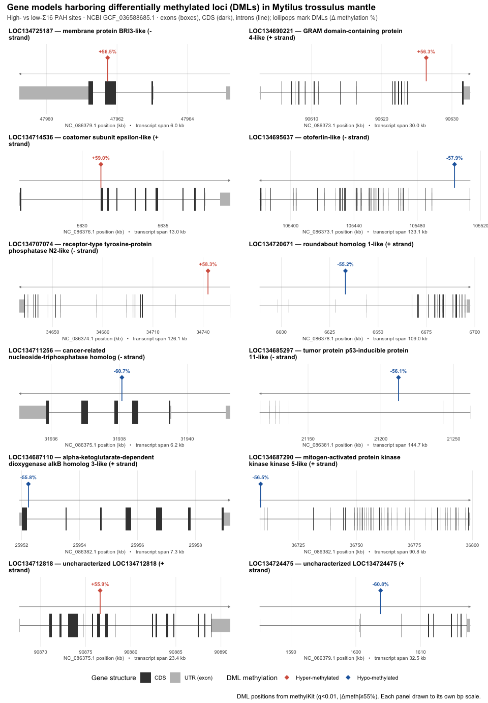

35- DML gene-model figure (Table 2)
================
Steven Roberts
11 June, 2026

-   [1 Overview](#1-overview)
-   [2 Download the NCBI GFF
    annotation](#2-download-the-ncbi-gff-annotation)
-   [3 Parse gene models](#3-parse-gene-models)
-   [4 DML set (Table 2) and coordinate
    verification](#4-dml-set-table-2-and-coordinate-verification)
-   [5 Build the figure](#5-build-the-figure)
-   [6 Summary table](#6-summary-table)
-   [7 Session info](#7-session-info)

------------------------------------------------------------------------

# 1 Overview

Publication-quality, multi-panel figure of the **10 annotated gene
models** that harbor the 12 differentially methylated loci (DMLs)
reported in `paper.md` Table 2, with each DML denoted on its gene model.
Companion to `30-dml-dmr-methylkit.Rmd` and `31-dml-dmr-annotation.Rmd`.

-   DML headline set: `../output/11-methylkit-klone/myDiff_1055p.tab`
    (methylKit, q&lt;0.01, \|meth.diff\|&gt;=55%; positions are 1-based
    CpG coordinates)
-   Reference: NCBI **GCF\_036588685.1** (PNRI\_Mtr1.1.1.hap1)
-   Annotation: downloaded NCBI GFF (this script)
-   Output dir: `../output/35-dml-gene-model-figure/`

`rtracklayer`/`GenomicFeatures` are not installed in this environment,
so the GFF is parsed directly with `data.table`/`awk`.

``` bash
mkdir -p ../output/35-dml-gene-model-figure
```

# 2 Download the NCBI GFF annotation

Downloads `GCF_036588685.1_..._genomic.gff` from the NCBI FTP if not
already present, then carves out the lines for the 10 genes of interest
so the rest of the script stays fast and reproducible.

``` bash
out="../output/35-dml-gene-model-figure"
gff="$out/genomic.gff"

if [ ! -s "$gff" ]; then
  url="https://ftp.ncbi.nlm.nih.gov/genomes/all/GCF/036/588/685/GCF_036588685.1_PNRI_Mtr1.1.1.hap1/GCF_036588685.1_PNRI_Mtr1.1.1.hap1_genomic.gff.gz"
  curl -sS -L -o "$gff.gz" "$url"
  gunzip -f "$gff.gz"
fi
ls -la "$gff"
```

    ## -rw-r--r--@ 1 sr320  staff  331324929 Jun 11 06:52 ../output/35-dml-gene-model-figure/genomic.gff

``` bash
out="../output/35-dml-gene-model-figure"

awk -F'\t' '
BEGIN{ s="LOC134725187 LOC134690221 LOC134714536 LOC134695637 LOC134707074 LOC134720671 LOC134711256 LOC134685297 LOC134712818 LOC134724475 LOC134687110 LOC134687290";
       n=split(s,g," "); for(i=1;i<=n;i++) want[g[i]]=1 }
/^#/{next}
{ if(match($9,/gene=[^;]+/)){ gname=substr($9,RSTART+5,RLENGTH-5); if(gname in want) print } }
' "$out/genomic.gff" > "$out/gene_models_raw.gff"

echo "feature lines: $(wc -l < "$out/gene_models_raw.gff")"
cut -f3 "$out/gene_models_raw.gff" | sort | uniq -c
```

    ## feature lines:     1269
    ##  596 CDS
    ##  624 exon
    ##   12 gene
    ##   37 mRNA

# 3 Parse gene models

``` r
library(data.table)
library(dplyr)
library(ggplot2)
library(patchwork)

out_dir <- "../output/35-dml-gene-model-figure"
raw <- fread(file.path(out_dir, "gene_models_raw.gff"), sep = "\t", header = FALSE,
             quote = "", col.names = c("chr","src","type","start","end",
                                       "score","strand","frame","attr"))

get_attr <- function(attr, key) {
  out <- rep(NA_character_, length(attr))
  m   <- regexpr(paste0(key, "=[^;]+"), attr)
  hit <- m > 0
  out[hit] <- sub(paste0(key, "="), "", regmatches(attr, m))
  out
}

raw[, gene := get_attr(attr, "gene")]
raw[, ID := get_attr(attr, "ID")]
raw[, Parent := get_attr(attr, "Parent")]
raw[, product := get_attr(attr, "product")]
raw[, description := get_attr(attr, "description")]

genes <- raw[type == "gene",
             .(gene, chr, start, end, strand,
               gene_desc = description, gene_id_full = ID)]

mrna  <- raw[type == "mRNA",
             .(gene, tx = ID, chr, start, end, strand, product)]

# exon / CDS counts per transcript to help pick the primary isoform
exon_counts <- raw[type == "exon", .N, by = .(tx = Parent)]
setnames(exon_counts, "N", "n_exon")

mrna <- merge(mrna, exon_counts, by = "tx", all.x = TRUE)
mrna[, span := end - start]

# Primary transcript = longest genomic span, tie-break by most exons, then ID
setorder(mrna, gene, -span, -n_exon, tx)
primary <- mrna[, .SD[1], by = gene]
primary[]
```

    ##             gene                 tx         chr     start       end strand
    ##           <char>             <char>      <char>     <int>     <int> <char>
    ##  1: LOC134685297 rna-XM_063544925.1 NC_086381.1  21116727  21261455      -
    ##  2: LOC134687110 rna-XM_063547109.1 NC_086382.1  25951921  25959192      +
    ##  3: LOC134687290 rna-XM_063547445.1 NC_086382.1  36708321  36799106      +
    ##  4: LOC134690221 rna-XM_063550200.1 NC_086373.1  90602585  90632630      +
    ##  5: LOC134695637 rna-XM_063556955.1 NC_086373.1 105380391 105513502      -
    ##  6: LOC134707074 rna-XM_063566562.1 NC_086374.1  34630047  34756161      -
    ##  7: LOC134711256 rna-XM_063571761.1 NC_086375.1  31935064  31941257      -
    ##  8: LOC134712818 rna-XM_063574731.1 NC_086375.1  90867638  90891015      +
    ##  9: LOC134714536 rna-XM_063575859.1 NC_086376.1   5626113   5639140      +
    ## 10: LOC134720671 rna-XM_063583078.1 NC_086378.1   6588729   6697712      +
    ## 11: LOC134724475 rna-XM_063587507.1 NC_086379.1   1585149   1617685      +
    ## 12: LOC134725187 rna-XM_063588806.1 NC_086379.1  47959226  47965210      -
    ##                                                                         product
    ##                                                                          <char>
    ##  1:        tumor protein p53-inducible protein 11-like%2C transcript variant X4
    ##  2:               alpha-ketoglutarate-dependent dioxygenase alkB homolog 3-like
    ##  3:                       mitogen-activated protein kinase kinase kinase 5-like
    ##  4:                                       GRAM domain-containing protein 4-like
    ##  5:                                     otoferlin-like%2C transcript variant X1
    ##  6: receptor-type tyrosine-protein phosphatase N2-like%2C transcript variant X1
    ##  7:   cancer-related nucleoside-triphosphatase homolog%2C transcript variant X1
    ##  8:                                                uncharacterized LOC134712818
    ##  9:                                               coatomer subunit epsilon-like
    ## 10:                          roundabout homolog 1-like%2C transcript variant X2
    ## 11:                       uncharacterized LOC134724475%2C transcript variant X1
    ## 12:                                                  membrane protein BRI3-like
    ##     n_exon   span
    ##      <int>  <int>
    ##  1:      7 144728
    ##  2:      7   7271
    ##  3:     42  90785
    ##  4:     18  30045
    ##  5:     45 133111
    ##  6:     21 126114
    ##  7:      6   6193
    ##  8:     16  23377
    ##  9:     11  13027
    ## 10:     26 108983
    ## 11:      9  32536
    ## 12:      4   5984

``` r
prim_tx <- primary$tx

exons <- raw[type == "exon" & Parent %in% prim_tx,
             .(gene, tx = Parent, start, end, strand)]
cds   <- raw[type == "CDS"  & Parent %in% prim_tx,
             .(gene, tx = Parent, start, end, strand)]

# attach gene to features via primary transcript map
tx2gene <- setNames(primary$gene, primary$tx)
exons[, gene := tx2gene[tx]]
cds[,   gene := tx2gene[tx]]

cat("exons per primary transcript:\n"); print(exons[, .N, by = gene])
```

    ## exons per primary transcript:

    ##             gene     N
    ##           <char> <int>
    ##  1: LOC134690221    18
    ##  2: LOC134695637    45
    ##  3: LOC134707074    21
    ##  4: LOC134711256     6
    ##  5: LOC134712818    16
    ##  6: LOC134714536    11
    ##  7: LOC134720671    26
    ##  8: LOC134724475     9
    ##  9: LOC134725187     4
    ## 10: LOC134685297     7
    ## 11: LOC134687110     7
    ## 12: LOC134687290    42

# 4 DML set (Table 2) and coordinate verification

The 12 DMLs of Table 2 are pulled from `myDiff_1055p.tab` by matching
q-values, then each is checked for containment within its assigned gene
span.

``` r
# Corrected genic DML set: 12 DMLs, each inside a unique gene (see
# 35a-dml-assignment-audit.R). The two intergenic loci previously assigned to
# LOC134725187 / LOC134711256 are dropped, and the two genic loci on
# NC_086382.1 (LOC134687110 alkB, LOC134687290 MAP3K5/ASK1) are added.
dml <- data.table(
  qvalue       = c(5.77e-14, 1.16e-11, 2.92e-13, 4.17e-14, 1.10e-13,
                   7.20e-13, 8.98e-18, 1.06e-12, 1.32e-13, 2.52e-16,
                   6.02e-14, 5.83e-13),
  chr          = c("NC_086379.1","NC_086373.1","NC_086376.1","NC_086373.1","NC_086374.1",
                   "NC_086378.1","NC_086375.1","NC_086381.1","NC_086375.1","NC_086379.1",
                   "NC_086382.1","NC_086382.1"),
  pos          = c(47961734, 90626338, 5631156, 105503509, 34742951,
                   6633121, 31938079, 21212100, 90876604, 1603830,
                   25952234, 36708761),
  assigned_gene= c("LOC134725187","LOC134690221","LOC134714536","LOC134695637","LOC134707074",
                   "LOC134720671","LOC134711256","LOC134685297","LOC134712818","LOC134724475",
                   "LOC134687110","LOC134687290"),
  meth_diff    = c(56.45, 56.32, 59, -57.86, 58.27,
                   -55.24, -60.69, -56.07, 55.88, -60.82,
                   -55.83, -56.50),
  status_paper = c("Hyper","Hyper","Hyper","Hypo","Hyper",
                   "Hypo","Hypo","Hypo","Hyper","Hypo",
                   "Hypo","Hypo")
)

# direction from the sign of meth.diff (hyper = +, hypo = -)
dml[, direction := factor(ifelse(meth_diff >= 0, "Hyper-methylated", "Hypo-methylated"),
                          levels = c("Hyper-methylated", "Hypo-methylated"))]

# verify each DML against its assigned gene span
gspan <- genes[, .(assigned_gene = gene, g_chr = chr, g_start = start,
                   g_end = end, g_strand = strand, gene_desc)]
dml <- merge(dml, gspan, by = "assigned_gene", all.x = TRUE, sort = FALSE)
dml[, in_gene_span := (chr == g_chr & pos >= g_start & pos <= g_end)]

dml[, .(assigned_gene, chr, pos, meth_diff, direction, status_paper,
        g_start, g_end, in_gene_span)][order(assigned_gene, pos)]
```

    ##     assigned_gene         chr       pos meth_diff        direction status_paper
    ##            <char>      <char>     <num>     <num>           <fctr>       <char>
    ##  1:  LOC134685297 NC_086381.1  21212100    -56.07  Hypo-methylated         Hypo
    ##  2:  LOC134687110 NC_086382.1  25952234    -55.83  Hypo-methylated         Hypo
    ##  3:  LOC134687290 NC_086382.1  36708761    -56.50  Hypo-methylated         Hypo
    ##  4:  LOC134690221 NC_086373.1  90626338     56.32 Hyper-methylated        Hyper
    ##  5:  LOC134695637 NC_086373.1 105503509    -57.86  Hypo-methylated         Hypo
    ##  6:  LOC134707074 NC_086374.1  34742951     58.27 Hyper-methylated        Hyper
    ##  7:  LOC134711256 NC_086375.1  31938079    -60.69  Hypo-methylated         Hypo
    ##  8:  LOC134712818 NC_086375.1  90876604     55.88 Hyper-methylated        Hyper
    ##  9:  LOC134714536 NC_086376.1   5631156     59.00 Hyper-methylated        Hyper
    ## 10:  LOC134720671 NC_086378.1   6633121    -55.24  Hypo-methylated         Hypo
    ## 11:  LOC134724475 NC_086379.1   1603830    -60.82  Hypo-methylated         Hypo
    ## 12:  LOC134725187 NC_086379.1  47961734     56.45 Hyper-methylated        Hyper
    ##       g_start     g_end in_gene_span
    ##         <int>     <int>       <lgcl>
    ##  1:  21116727  21261455         TRUE
    ##  2:  25951921  25959192         TRUE
    ##  3:  36708321  36799106         TRUE
    ##  4:  90602585  90632630         TRUE
    ##  5: 105380391 105513502         TRUE
    ##  6:  34630047  34756161         TRUE
    ##  7:  31935064  31941257         TRUE
    ##  8:  90867638  90891015         TRUE
    ##  9:   5626113   5639140         TRUE
    ## 10:   6588729   6697712         TRUE
    ## 11:   1585149   1617687         TRUE
    ## 12:  47959226  47965210         TRUE

``` r
cat("DMLs inside their assigned gene span:", sum(dml$in_gene_span), "of", nrow(dml), "\n\n")
```

    ## DMLs inside their assigned gene span: 12 of 12

``` r
cat("DMLs NOT inside assigned gene span:\n")
```

    ## DMLs NOT inside assigned gene span:

``` r
print(dml[in_gene_span == FALSE, .(assigned_gene, chr, pos, meth_diff)])
```

    ## Empty data.table (0 rows and 4 cols): assigned_gene,chr,pos,meth_diff

**Note.** This is the **corrected** DML set (see
`35a-dml-assignment-audit.R`). All 12 DMLs fall cleanly inside a unique
gene body — i.e. 12 DMLs across 12 genes, none bidirectional. An earlier
version of the manuscript Table 2 assigned two intergenic loci
(`NC_086379.1:64017640` and `NC_086375.1:43581688`, \~16 Mb / \~11 Mb
from their listed genes) to LOC134725187 and LOC134711256, making them
appear bidirectional, while omitting two genuinely genic loci on
NC\_086382.1 (LOC134687110 *alkB homolog 3-like* and LOC134687290
*MAP3K5 / ASK1-like*). The intergenic loci are dropped here and the two
genic loci added.

# 5 Build the figure

``` r
# warm = hyper, cool = hypo
dml_cols <- c("Hyper-methylated" = "#D6604D", "Hypo-methylated" = "#2166AC")
feat_cols <- c("CDS" = "grey25", "UTR (exon)" = "grey75")

short_name <- function(desc) {
  desc <- sub(", transcript variant.*$", "", desc)
  desc
}

build_panel <- function(gid) {
  g  <- genes[gene == gid]
  tx <- primary[gene == gid]
  ex <- exons[gene == gid]
  cd <- cds[gene == gid]
  dd <- dml[assigned_gene == gid & in_gene_span == TRUE]

  # plot coordinates in kb (absolute genomic position)
  x0 <- tx$start / 1e3
  x1 <- tx$end   / 1e3

  ymax_dml <- 1.15
  # invisible layer carrying both DML levels so every panel yields an
  # identical colour guide (patchwork then collapses it to one legend)
  dummy <- data.frame(
    direction = factor(c("Hyper-methylated", "Hypo-methylated"),
                       levels = c("Hyper-methylated", "Hypo-methylated")),
    x = x0, y = 0)

  p <- ggplot() +
    # intron line spanning the primary transcript
    geom_segment(aes(x = x0, xend = x1, y = 0, yend = 0),
                 linewidth = 0.4, colour = "grey40") +
    geom_point(data = dummy, aes(x = x, y = y, colour = direction),
               alpha = 0, shape = 18, size = 3) +
    # exon boxes (UTR height)
    geom_rect(data = ex,
              aes(xmin = start/1e3, xmax = end/1e3, ymin = -0.22, ymax = 0.22,
                  fill = "UTR (exon)"), colour = NA) +
    # CDS boxes (full height, drawn over exons)
    geom_rect(data = cd,
              aes(xmin = start/1e3, xmax = end/1e3, ymin = -0.38, ymax = 0.38,
                  fill = "CDS"), colour = NA)

  # strand direction arrow above the model
  arr_y <- 0.62
  if (tx$strand == "+") {
    p <- p + annotate("segment", x = x0, xend = x1, y = arr_y, yend = arr_y,
                      colour = "grey55", linewidth = 0.3,
                      arrow = arrow(length = unit(0.10, "cm"), type = "closed"))
  } else {
    p <- p + annotate("segment", x = x1, xend = x0, y = arr_y, yend = arr_y,
                      colour = "grey55", linewidth = 0.3,
                      arrow = arrow(length = unit(0.10, "cm"), type = "closed"))
  }

  # DML lollipops
  if (nrow(dd) > 0) {
    p <- p +
      geom_segment(data = dd,
                   aes(x = pos/1e3, xend = pos/1e3, y = 0.38, yend = ymax_dml,
                       colour = direction), linewidth = 0.6, show.legend = FALSE) +
      geom_point(data = dd,
                 aes(x = pos/1e3, y = ymax_dml, colour = direction),
                 size = 3, shape = 18, show.legend = FALSE) +
      geom_text(data = dd,
                aes(x = pos/1e3, y = ymax_dml + 0.22,
                    label = sprintf("%+.1f%%", meth_diff), colour = direction),
                size = 2.7, fontface = "bold", show.legend = FALSE)
  }

  lab <- sprintf("%s  \u2014  %s  (%s strand)",
                 gid, short_name(g$gene_desc), tx$strand)
  # wrap long titles so adjacent column panels don't collide
  lab <- paste(strwrap(lab, width = 52), collapse = "\n")
  span_kb <- (tx$end - tx$start) / 1e3

  p +
    scale_fill_manual(values = feat_cols, name = "Gene structure",
                      breaks = c("CDS","UTR (exon)")) +
    scale_colour_manual(values = dml_cols, name = "DML methylation",
                        drop = FALSE) +
    guides(colour = guide_legend(
      override.aes = list(alpha = 1, shape = 18, size = 3, linetype = 0))) +
    scale_y_continuous(limits = c(-0.7, ymax_dml + 0.45), expand = c(0,0)) +
    labs(title = lab,
         x = sprintf("%s position (kb)   \u2022   transcript span %.1f kb",
                     g$chr, span_kb)) +
    theme_minimal(base_size = 10) +
    theme(
      plot.title = element_text(size = 9.2, face = "bold"),
      axis.title.x = element_text(size = 7.5, colour = "grey30"),
      axis.text.x = element_text(size = 7),
      axis.title.y = element_blank(),
      axis.text.y = element_blank(),
      panel.grid.major.y = element_blank(),
      panel.grid.minor = element_blank(),
      panel.grid.major.x = element_line(colour = "grey92", linewidth = 0.3),
      legend.position = "bottom"
    )
}
```

``` r
# order panels by paper functional grouping
gene_order <- c(
  # Membrane dynamics and vesicle trafficking
  "LOC134725187","LOC134690221","LOC134714536","LOC134695637",
  # Cell signaling and regulation
  "LOC134707074","LOC134720671",
  # Stress response, apoptosis, and nucleic acid metabolism
  "LOC134711256","LOC134685297","LOC134687110","LOC134687290",
  # Uncharacterized
  "LOC134712818","LOC134724475")

panels <- lapply(gene_order, build_panel)

fig <- wrap_plots(panels, ncol = 2) +
  plot_layout(guides = "collect") +
  plot_annotation(
    title = "Gene models harboring differentially methylated loci (DMLs) in Mytilus trossulus mantle",
    subtitle = "High- vs low-\u03a316 PAH sites \u00b7 NCBI GCF_036588685.1 \u00b7 exons (boxes), CDS (dark), introns (line); lollipops mark DMLs (\u0394 methylation %)",
    caption = "DML positions from methylKit (q<0.01, |\u0394meth|\u226555%). Each panel drawn to its own bp scale.",
    theme = theme(plot.title = element_text(face = "bold", size = 13),
                  plot.subtitle = element_text(size = 9, colour = "grey30"))
  ) &
  theme(legend.position = "bottom")

ggsave(file.path(out_dir, "dml_gene_models.png"), fig,
       width = 10, height = 14.4, dpi = 300, bg = "white")
ggsave(file.path(out_dir, "dml_gene_models.pdf"), fig,
       width = 10, height = 14.4, bg = "white")

fig
```



# 6 Summary table

``` r
# nearest-gene context for the two intergenic loci (computed from the GFF)
nearest_note <- c(
  "NC_086379.1:64017640" = "intergenic; nearest gene LOC134725550 (protein chibby homolog 1-like), ~3.7 kb",
  "NC_086375.1:43581688" = "intergenic; nearest gene LOC134711544 (solute carrier family 40 member 1-like), ~1.0 kb"
)

n_exon_map <- exons[, .N, by = gene]
setnames(n_exon_map, "N", "exon_count")

summary_tab <- dml |>
  merge(n_exon_map, by.x = "assigned_gene", by.y = "gene", all.x = TRUE, sort = FALSE) |>
  merge(primary[, .(assigned_gene = gene, primary_tx = tx)], by = "assigned_gene",
        all.x = TRUE, sort = FALSE)

summary_tab[, gene_span := paste0(g_start, "-", g_end)]
summary_tab[, locus := paste0(chr, ":", pos)]
summary_tab[, note := ifelse(in_gene_span, "DML within gene body",
                             nearest_note[locus])]

summary_out <- summary_tab[order(assigned_gene, pos),
  .(gene_id = assigned_gene, gene_description = gene_desc, chr,
    gene_span, strand = g_strand, primary_tx, exon_count,
    dml_position = pos, qvalue, meth_diff, direction,
    status_paper, in_gene_span, note)]

fwrite(summary_out, file.path(out_dir, "dml_gene_model_summary.tsv"), sep = "\t")
fwrite(summary_out, file.path(out_dir, "dml_gene_model_summary.csv"))
knitr::kable(summary_out)
```

| gene\_id     | gene\_description                                             | chr          | gene\_span          | strand | primary\_tx         | exon\_count | dml\_position | qvalue | meth\_diff | direction        | status\_paper | in\_gene\_span | note                 |
|:-------------|:--------------------------------------------------------------|:-------------|:--------------------|:-------|:--------------------|------------:|--------------:|-------:|-----------:|:-----------------|:--------------|:---------------|:---------------------|
| LOC134685297 | tumor protein p53-inducible protein 11-like                   | NC\_086381.1 | 21116727-21261455   | \-     | rna-XM\_063544925.1 |           7 |      21212100 |      0 |     -56.07 | Hypo-methylated  | Hypo          | TRUE           | DML within gene body |
| LOC134687110 | alpha-ketoglutarate-dependent dioxygenase alkB homolog 3-like | NC\_086382.1 | 25951921-25959192   | \+     | rna-XM\_063547109.1 |           7 |      25952234 |      0 |     -55.83 | Hypo-methylated  | Hypo          | TRUE           | DML within gene body |
| LOC134687290 | mitogen-activated protein kinase kinase kinase 5-like         | NC\_086382.1 | 36708321-36799106   | \+     | rna-XM\_063547445.1 |          42 |      36708761 |      0 |     -56.50 | Hypo-methylated  | Hypo          | TRUE           | DML within gene body |
| LOC134690221 | GRAM domain-containing protein 4-like                         | NC\_086373.1 | 90602585-90632630   | \+     | rna-XM\_063550200.1 |          18 |      90626338 |      0 |      56.32 | Hyper-methylated | Hyper         | TRUE           | DML within gene body |
| LOC134695637 | otoferlin-like                                                | NC\_086373.1 | 105380391-105513502 | \-     | rna-XM\_063556955.1 |          45 |     105503509 |      0 |     -57.86 | Hypo-methylated  | Hypo          | TRUE           | DML within gene body |
| LOC134707074 | receptor-type tyrosine-protein phosphatase N2-like            | NC\_086374.1 | 34630047-34756161   | \-     | rna-XM\_063566562.1 |          21 |      34742951 |      0 |      58.27 | Hyper-methylated | Hyper         | TRUE           | DML within gene body |
| LOC134711256 | cancer-related nucleoside-triphosphatase homolog              | NC\_086375.1 | 31935064-31941257   | \-     | rna-XM\_063571761.1 |           6 |      31938079 |      0 |     -60.69 | Hypo-methylated  | Hypo          | TRUE           | DML within gene body |
| LOC134712818 | uncharacterized LOC134712818                                  | NC\_086375.1 | 90867638-90891015   | \+     | rna-XM\_063574731.1 |          16 |      90876604 |      0 |      55.88 | Hyper-methylated | Hyper         | TRUE           | DML within gene body |
| LOC134714536 | coatomer subunit epsilon-like                                 | NC\_086376.1 | 5626113-5639140     | \+     | rna-XM\_063575859.1 |          11 |       5631156 |      0 |      59.00 | Hyper-methylated | Hyper         | TRUE           | DML within gene body |
| LOC134720671 | roundabout homolog 1-like                                     | NC\_086378.1 | 6588729-6697712     | \+     | rna-XM\_063583078.1 |          26 |       6633121 |      0 |     -55.24 | Hypo-methylated  | Hypo          | TRUE           | DML within gene body |
| LOC134724475 | uncharacterized LOC134724475                                  | NC\_086379.1 | 1585149-1617687     | \+     | rna-XM\_063587507.1 |           9 |       1603830 |      0 |     -60.82 | Hypo-methylated  | Hypo          | TRUE           | DML within gene body |
| LOC134725187 | membrane protein BRI3-like                                    | NC\_086379.1 | 47959226-47965210   | \-     | rna-XM\_063588806.1 |           4 |      47961734 |      0 |      56.45 | Hyper-methylated | Hyper         | TRUE           | DML within gene body |

# 7 Session info

``` r
sessionInfo()
```

    ## R version 4.3.2 (2023-10-31)
    ## Platform: aarch64-apple-darwin20 (64-bit)
    ## Running under: macOS Sonoma 14.7.6
    ## 
    ## Matrix products: default
    ## BLAS:   /Library/Frameworks/R.framework/Versions/4.3-arm64/Resources/lib/libRblas.0.dylib 
    ## LAPACK: /Library/Frameworks/R.framework/Versions/4.3-arm64/Resources/lib/libRlapack.dylib;  LAPACK version 3.11.0
    ## 
    ## locale:
    ## [1] C
    ## 
    ## time zone: America/Los_Angeles
    ## tzcode source: internal
    ## 
    ## attached base packages:
    ## [1] stats     graphics  grDevices utils     datasets  methods   base     
    ## 
    ## other attached packages:
    ## [1] patchwork_1.3.1   ggplot2_3.5.1     dplyr_1.1.4       data.table_1.16.0
    ## [5] knitr_1.48       
    ## 
    ## loaded via a namespace (and not attached):
    ##  [1] vctrs_0.6.5       cli_3.6.3         rlang_1.1.4       xfun_0.48        
    ##  [5] highr_0.11        generics_0.1.3    textshaping_0.4.0 labeling_0.4.3   
    ##  [9] glue_1.8.0        colorspace_2.1-1  htmltools_0.5.8.1 ragg_1.3.3       
    ## [13] scales_1.3.0      fansi_1.0.6       rmarkdown_2.28    grid_4.3.2       
    ## [17] munsell_0.5.1     evaluate_1.0.0    tibble_3.2.1      fastmap_1.2.0    
    ## [21] yaml_2.3.10       lifecycle_1.0.4   compiler_4.3.2    pkgconfig_2.0.3  
    ## [25] systemfonts_1.1.0 farver_2.1.2      digest_0.6.37     R6_2.5.1         
    ## [29] tidyselect_1.2.1  utf8_1.2.4        pillar_1.9.0      magrittr_2.0.3   
    ## [33] withr_3.0.1       tools_4.3.2       gtable_0.3.6
